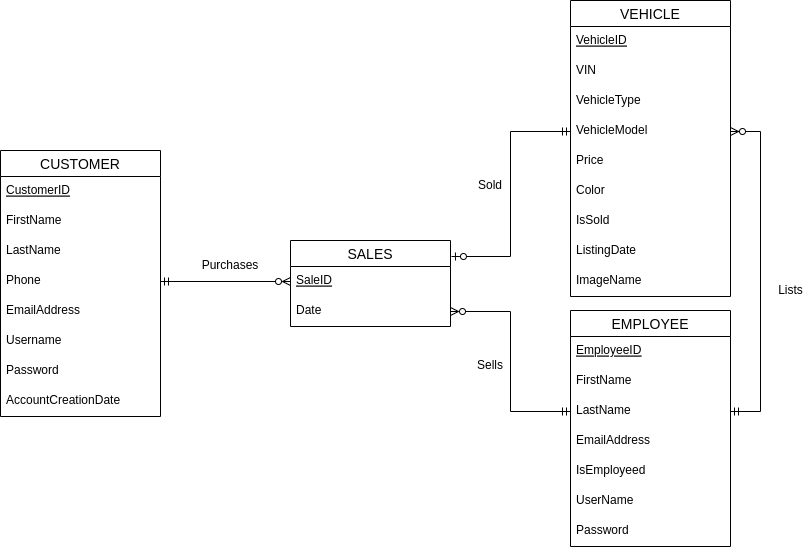
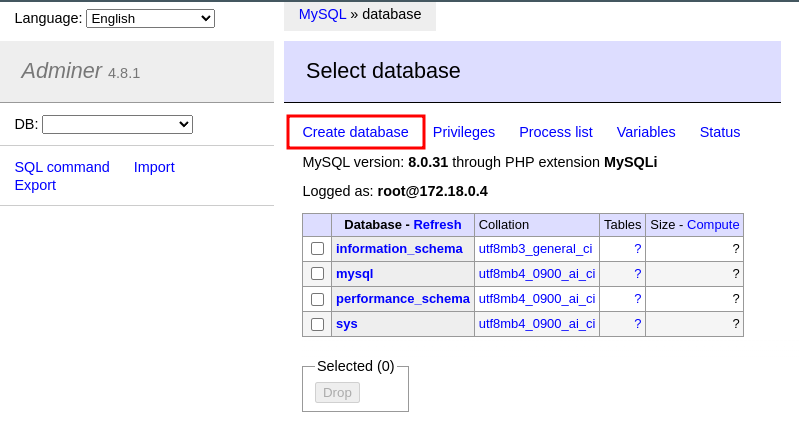
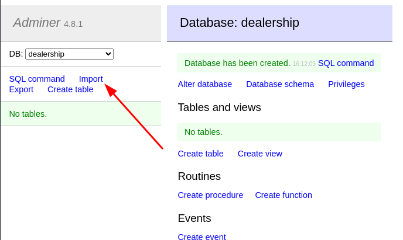

# Car Dealership Website

This web application simulates the functionality of a basic car dealership website.

Within the application, there are 2 types of users:

- Customers: Users who can create accounts, purchase vehicles, and view their profile
- Employees: Preset users who can list vehicles and view previous sales

The application is intended to operate as follows:

Customers and employees are able to log into the application through the use of a database,
where their username and password hashes are stored. Each type of user can perform different
actions in the application depending on their role (customer or employee). For example, customers
are able to purchase vehicles while employees are able list vehicles.

## Execution

Docker and Docker-Compose are required for this program to run. To run, you will need to enter
`docker-compose up` within this project directory. After all the required images are pulled,
please read the [Adminer](#adminer) portion of this document.

## Project Structure

The project is layed out in the following way:

```
.
├── screenshots             # Images for this README file
│  └── ...
├── scripts                 # SQL scripts to create initial tables and populate data
│  ├── create_tables.sql
│  └── insert_data.sql
├── src
│  ├── assets               # Where listed vehicle images and other site images are stored
│  ├── authentication
│  ├── components           # Contains reused components such as banners
│  └── ...
├── docker-compose.yml      # Used to launch all the PHP Apache server and MySQL database
├── Dockerfile              # Creates a modified PHP:Apache image with the mysqli plugin
└── README.md
```

### PHP Apache Server

This program uses PHP to interact with the backend MySQL database to display dynamic content to
the users. All files placed within the `src/` directory are placed in the Docker container when
running and is stored under the `/var/www/html/` directory within the container.

To access the web application on your machine, you must go to **http://localhost** in your browser.
Port **80** is being used.

### MySQL Database

For the backend, a MySQL server is running that stores user information including their usernames,
password hashes, and purchase/sales history depending on the role of the user.

The database is layed out as follows:



### Adminer

A third image used in this application is Adminer, which allows for database management inside
our browsers. In this application it is hosted under **http://localhost:8080**.

Upon launch you will be prompted for the following information:

  - Server name: **database**
  - Default user: **root**
  - Default password: **password**

If running for the first time, leave *database* blank. You will need to populate the database by
using the provided SQL scripts under the `scripts/` directory. You can do so by following these
steps:

After logging in, create a new database. It can be any name but in this case I will call it
*dealership*.



Upon completion, we need to source our SQL scripts. `create_tables.sql` should be executed first.
If successful, all initial data will be populated in each of the tables.

**Note: All users have their passwords initially set to** `Password123`


